# Spatial Analysis of Crop Yields in Malawi
Kathleen Rychlicki  
December 14, 2015  

---


```r
# loading required packages
knitr::opts_chunk$set(cache=T)
library(knitr)
library(dplyr)
library(tidyr)
library(ggplot2)
library(raster)
library(rasterVis)
library(xtable)
library(scales)
library(FAOSTAT)
library(MODISTools)
library(gdalUtils)
library(rts)
library(countrycode)
library(sp)
library(rgeos)
library(rgdal)
library(ncdf)
library(rnoaa)
library(climdex.pcic)
library(zoo)
library(reshape2)
library(maps)
library(ggmap)
library(ggthemes)
library(captioner)
library(EnvStats)
```

###**Abstract**
This report offers a spatial analysis on the crop yields for Malawi, a small country in Africa, over time in relation to the land cover of the cropland. The report focuses on three crops: Cassava, Maize and Potatoes. The climate of the area over time is examined to see the effects of climate on the crop yields. Climate indices that will help inform of the reason for the low crops are annual mean temperature and annual precipitation. After this, agricultural pixels have been pulled from MODIS for the region. The following report will look at 500m croplands to observe the land of Malawi that is responsible for producing crops and analyzes the 250m vegetation(NVDI) index. 

###**Introduction**

Malawi is located at a latitude and longitude, 13.9500? S, 33.7000? E, respectively, and is known as the "Warm Heart of Africa", according to the _New Agriculturist_. It is a large agricultural country at heart, in which eighty-four percent of Malawians live in rural areas where approximately 11 million are involved in subsistence farming. Though the majority of farmers have less than a hectare(100 acres) of land to grow their food, they are still able to produce important crops. According to the FAOSTAT Data, the top 3 crop yields in Malawi are Cassava, Maize and Potatoes. 

Despite being a large agricultural country, Malawi has faced many drawbacks that have inhibited farmers from being able to produce adequate crop yields. The first factor is the country terrain. Two-thirds of the land is made of mountains, forests and rough pastures, making the land unsuitable for cultivation. Secondly, previously to 2005, Malawi experience severe droughts. This led to food shortages where the country had to rely on food aid. It was after 2005 that the Malawian Government decided to take measures to ensure food security. They subsidized seed varieties and fertilizer, which was effective in increasing maize production. In order to avoid the effects of future droughts on yields, there is currently a Greenbelt Initiative that is working to irrigate one million hectares of land; taking advantage of Malawi's location to three lakes and thirteen rivers. Finally, Malawi has increasing population growth, which is having a negative effect on its natural resources and farmers are forced to work on terrain that is less suitable for production.


###**Data and Methods**

Country data is obtained from the FAO*. Country level (1) data is obtained for Malawi. GADM is a spatial database of the world's administrative areas of all countries, at all levels using a high spatial resolution.

```r
getData("ISO3")%>%
  as.data.frame%>%
  filter(NAME=="Malawi")
```

```
##   ISO3   NAME
## 1  MWI Malawi
```


```r
#Retrieving Malawi country borders
mw=getData('GADM', country='MWI', level=1)
mw2=gSimplify(mw,tol = 0.1,topologyPreserve=T)
```


####**Elevation Data**

The _Shuttle Radar Topography Mission_ (SRTM) is an international research effort that obtained digital elevation models on a global-scale through agreement with NASA and the NGA. According to the USGS site, the project produces topographic data for 80% of the Earth's land surface with data points located every 1-arc second on a latitude/longitude grid. 

To cover the entire country of Malawi with topographical elevation data, five tiles were downloaded with different latitudes and longitudes. Using extent(), each tile was aligned so that all tiles match. After merging the tiles together, the elevation was plotted with the Malawi's country border added to see the elevation of the entire country.

```r
mwi=gCentroid(mw2)%>%coordinates()

dem1=getData("SRTM",lat=mwi[2],lon=mwi[1])
mw2=gSimplify(mw,tol = 0.1,topologyPreserve=T)

fdem="dem.tif"

if(!file.exists(fdem)){
dem2=getData("SRTM",lat=-8.3702,lon=34.4943)
dem3=getData("SRTM",lat=-9.4048,lon=31.3953)
dem4=getData("SRTM",lat=-17.3156,lon=33.2004)
dem5=getData("SRTM",lat=-16.4751,lon=37.3947)
dem6=getData("SRTM",lat=-14.4001,lon=36.3003)

extent(dem1)=alignExtent(dem1,dem2)
extent(dem4)=alignExtent(dem4,dem3)
extent(dem5)=alignExtent(dem5,dem3)
extent(dem6)=alignExtent(dem6,dem3)

dem=merge(dem1,dem2,dem3,dem4,dem5,dem6, file=fdem)
}

dem=raster(fdem)
plot(dem)
plot(mw2,add=T)
```

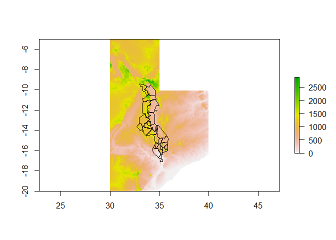 

####**Crop Yields**

Crop Yield data is obtained from the FAOSTAT. Achieving food security for all is at the heart of FAO's efforts - to make sure people have regular access to enough high-quality food to lead active, healthy lives. 
Crop Yields will be examined using the top 3 crops yielded in Malawi: Cassava, Maize, Potatoes.


**_FAO Codes:_**

Crop          | Code
------------- | ------------- 
Cassava       | 125      
Maize         | 56
Potatoes      | 116

Element       | Code
------------- | ------------- 
Area Harvested| 5312     
Yield         | 5314
Production    | 5510

***
Each crop is converted into a data frame using the FAOSTAT Package provided. Through this package, the getFAOtoSYB function is used to download multiple elements at once. After the information has been downloaded, the elements, Area Harvested, Yield and Production are plotted.


```r
#Getting FAOSTAT3 Data:
Maize.df = getFAOtoSYB(name = c("AreaHarvested", "Yield", "Production"), domainCode = c("QC", "QC", "QC"), elementCode = c(5312,5419,5510), itemCode =c(56, 56, 56), printURL = FALSE, useCHMT = TRUE, outputFormat = "wide",countrySet = 130)

Cassava.df = getFAOtoSYB(name = c("AreaHarvested", "Yield", "Production"), domainCode = c("QC", "QC", "QC"), elementCode = c(5312,5419,5510), itemCode =c(125, 125, 125), printURL = FALSE, useCHMT = TRUE, outputFormat = "wide",countrySet = 130)
 
Potatoes.df = getFAOtoSYB(name = c("AreaHarvested", "Yield", "Production"), domainCode = c("QC", "QC", "QC"), elementCode = c(5312,5419,5510), itemCode =c(116, 116, 116), printURL = FALSE, useCHMT = TRUE, outputFormat = "wide",countrySet = 130)
```
***

```r
cropd = bind_rows(data.frame(crop="Maize",Maize.df$entity),data.frame(crop="Cassava",Cassava.df$entity), data.frame(crop="Potatoes", Potatoes.df$entity))
```

```
## Warning in rbind_all(x, .id): Unequal factor levels: coercing to character
```

***
**_Area Harvested_**

The area harvested plot shows where the crop was gathered and eliminates the area where there was no harvest due to damage or failure. The area harvested is only recorded once in the case of successive gathering of the crop during the year from the same standing crops, according to the FAO Statistics Division.

```r
#Plotting Area Harvested
ggplot(cropd, aes(x=Year, y=AreaHarvested, color=crop))+
  ggtitle("Area Harvested")+
  ylab("Value (Ha)
         *Ha = hectare; equal to 10,000 square metres; 
          2.471 acre
                                     ")+  
  theme_stata()+
  scale_colour_wsj("colors6", "")+
  geom_line()
```

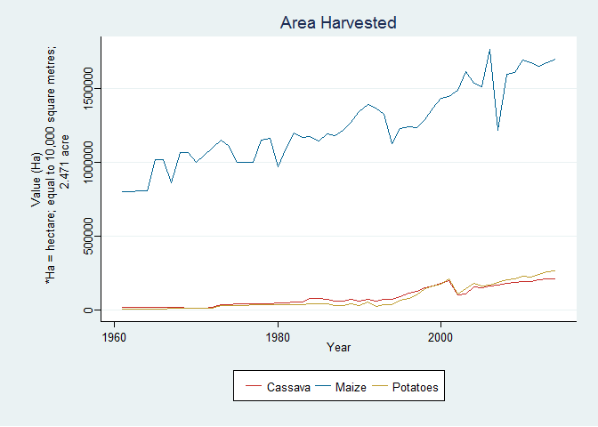 

As shown in the above plot of the Area Harvested, the majority of the hectares of land in Malawi are dedicated for Maize production. This would make one think that Maize will then produce the highest yield. There was also a large decrease in the area being harvested for Maize around 2005. This could be due to the fact of the droughts that were occurring before this time. As stated in the analysis, the government began subsidizing the land to improve crop yields and reverse the food shortage.

***
**_Yield_**

The crop yield from the FAO Statistics Division shows the harvested production per unity of harvested area for crop products. According to the FAO, the majority of this data is obtained by dividing the production data by the data on area harvested. 

```r
#Plotting Yield
ggplot(cropd, aes(x=Year, y=Yield, color=crop))+
  ggtitle("Yield")+
  ylab("Value (Hg/Ha) 
       *Hg/Ha = hectogram (100 grammes)
                                     ")+
  theme_stata()+
  scale_colour_wsj("colors6", "")+
  geom_line()
```

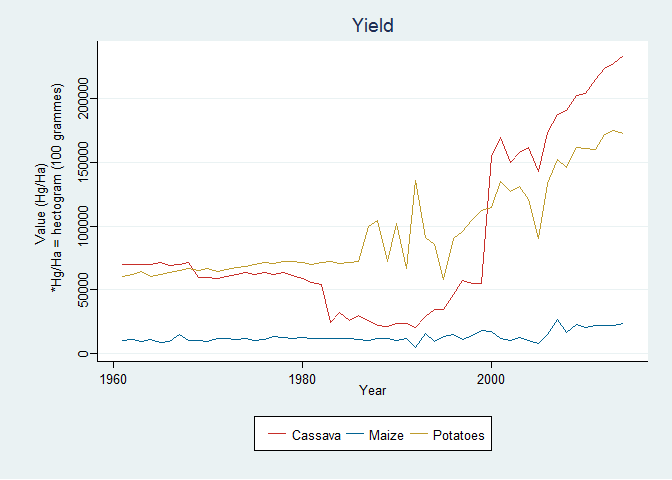 

The crop yield plot shows that Maize is, surprisingly, producing the lowest yield, for having the most area harvested. Cassava and Potatoes have been on an upward trend since 2005.

***
**_Production_**

Crop production data, from the FAO Statistics Division, is the actual harvested production from the field, excluding harvesting and threshing losses and that part of the crop not harvested for any reason. Therefore, the production includes the quantities of the commodity sold in the market and the quantities consumed by the producers. The majority of this data is obtained as a function of the estimated yield and the total area. 

```r
#Plotting Production
ggplot(cropd, aes(x=Year, y=Production, color=crop))+
  ggtitle("Production")+
  ylab("Value (tonnes)
      *Tonnes = Metric ton: 1,000 kilograms
                                     ")+
  theme_stata()+
  scale_colour_wsj("colors6", "")+
  geom_line()
```

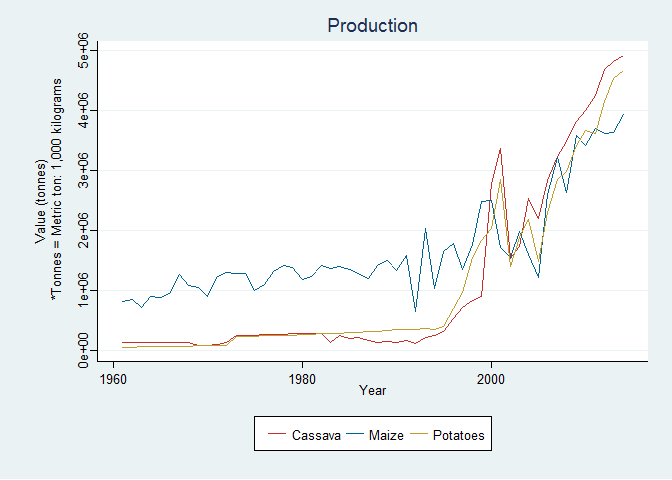 


####**Climate Data**
Climate Data is obtained from the National Centers for Environmental Information (NCEI)-National Oceanic and Atmospheric Administration (NOAA). According to their site, the NCEI is the world's largest provider of weather and climate data with available data sets for land-based, marine, model, radar, weather, etc. This report views the NCEI's Global Historical Climatology Network-Daily (GHCN-D). The GHCN-D is formatted to include daily temperature, precipitation and snow records over global land areas.

By using the NCDC database, the ghcnd stations are downloaded and filtered by the core values in the database. This analysis focuses on the following three values: Precipitation(PRCP - tenths of mm), Maximum Temperature(TMAX) and Minimum Temperature(TMIN). 

The data for station "MIM00067586" is retrieved as it provides the most approximate location with the country of Malawi. This is the station in Malawi called 'LILONGWE INTL'. Shown below, the coordinates of the station reside at Latitude, Longitude [-13.7839, 33.7670] respectively. According to the NOAA-NCDC, the elevation at these coordinates is 1229.00.


```r
datadir="data"
```

```r
d=ghcnd("MIM00067586", path = datadir)
d$data[1:5,1:12]
```

```
##            id year month element VALUE1 MFLAG1 QFLAG1 SFLAG1 VALUE2 MFLAG2
## 1 MIM00067586 1982     5    TMAX  -9999            NA         -9999       
## 2 MIM00067586 1982     5    TMIN    130            NA      S  -9999       
## 3 MIM00067586 1982     5    PRCP  -9999            NA         -9999       
## 4 MIM00067586 1982     5    TAVG    213      H     NA      S  -9999       
## 5 MIM00067586 1982     6    TMAX    216            NA      S    220       
##   QFLAG2 SFLAG2
## 1              
## 2              
## 3              
## 4              
## 5             S
```


```r
#Reshaping Data
d1=ghcnd_splitvars(d)
str(d1,list.len = 3)
```

```r
#Merge Datasets
d2=lapply(1:length(d1),function(i) {
  x=d1[[i]]
  ivar=names(d1)[i]
  x$var=ivar
  x$val=unlist(x[,ivar])
  return(dplyr::select(x,-contains(ivar)))})%>%
  bind_rows()
```

```r
#Filter the merged datasets and convert the degrees, while removing bad data (e.g. -9999 values)
d3=d2%>%
  filter( 
    qflag==" " &
    var%in%c("tmax","tmin","prcp"))%>%                            
  mutate(val=ifelse(val==-9999,NA,val))%>%
  mutate(val=ifelse(var%in%c("tmax","tmin"), val/10,val))%>%  
  arrange(var,date)

#Preparing data to be plotted using a reshaping of the dataset
d3b=dcast(d3,id+date~var,value.var="val")%>%
  arrange(date)%>%
  na.omit() 
```

```r
#Plotting temperature of TMAX and TMIN by date. 
ggplot(d3b,
       aes(ymax=tmax,ymin=tmin,x=date))+
  geom_ribbon(col="grey")+
  geom_ribbon(fill="lightsteelblue2")+
  ggtitle("Temperature (TMAX+TMIN)/2")+
  geom_line(aes(y=(tmax+tmin)/2),col="royalblue4")
```

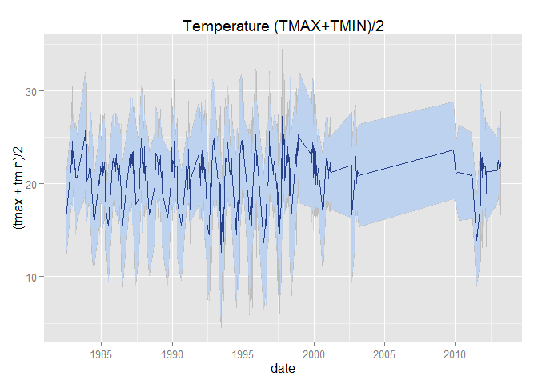 

```r
#Calculating a 60-day rolling average to view TimeSeries of the TMAX and TMIN.
d4 = d3b %>% 
  arrange(date) %>%
  mutate(tmax.60 = rollmean(x = tmax, 60, align = "center", fill = NA),
         tmax.b60 = rollmean(x = tmax, 60, align = "right", fill = NA))


ggplot(filter(d4,date>as.Date("1982-07-07")),
       aes(ymax=tmax,ymin=tmin,x=date))+
  geom_ribbon(fill="lightsteelblue2")+
  ggtitle("60-Day Rolling Average")+
  geom_line(aes(y=(tmin+tmax)/2),col=grey(0.4),size=.5)+
  geom_line(aes(y=tmax.60),col="royalblue4", size=1)+
  geom_line(aes(y=tmax.b60),col="royalblue1", size=1)
```

```
## Warning: Removed 58 rows containing missing values (geom_path).
```

```
## Warning: Removed 58 rows containing missing values (geom_path).
```

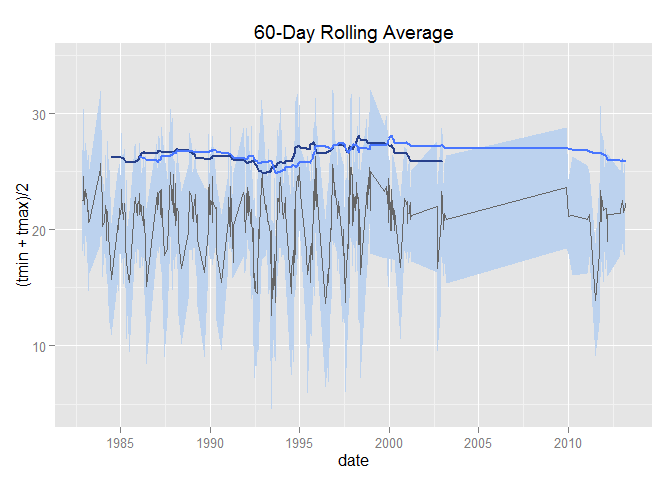 

**Time Series Analysis**


```r
#To view a time series analysis of the temperatures for Malawi 
tmin.ts=ts(d3b$tmin,deltat=1/365)
ggplot(d3b,aes(y=tmax,x=lag(tmax)))+
  geom_point(col="steelblue2")+
  geom_abline(intercept=0, slope=1)
```

```
## Warning: Removed 1 rows containing missing values (geom_point).
```

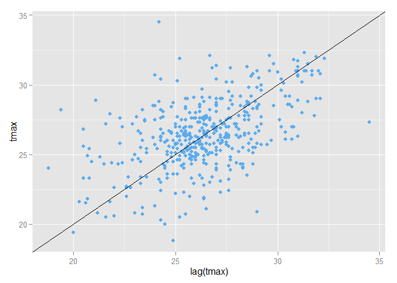 

```r
#Autocorrelation
acf(tmin.ts,lag.max = 365*3)
```

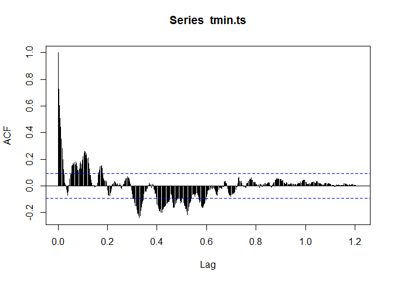 

```r
#Growing the data by month, season, year and decade
d4=d3b%>%
  mutate(month=as.numeric(format(date,"%m")),
        year=as.numeric(format(date,"%Y")),
        season=ifelse(month%in%c(12,1,2),"Winter",
            ifelse(month%in%c(3,4,5),"Spring",
              ifelse(month%in%c(6,7,8),"Summer",
                ifelse(month%in%c(9,10,11),"Fall",NA)))),
        dec=(floor(as.numeric(format(date,"%Y"))/10)*10))

#Assessing the change and summarizing TMIN, TMAX and PRCP by mean
d4%>%
  mutate(period=ifelse(year<=1976-01-01,"early","late"))%>%
  group_by(period)%>%
  summarize(n=n(),tmin=mean(tmin),tmax=mean(tmax),prcp=mean(prcp))
```

```
## Source: local data frame [1 x 5]
## 
##   period     n     tmin     tmax     prcp
##    (chr) (int)    (dbl)    (dbl)    (dbl)
## 1   late   444 15.33243 26.44077 42.67117
```

```r
seasonal=d4%>%
  group_by(year,season)%>%
  summarize(n=n(),tmin=mean(tmin),tmax=mean(tmax),prcp=mean(prcp))

#Plotting Seasonal Time Series Data
ggplot(seasonal,aes(y=((tmin+tmax)/2),x=year))+
  facet_wrap(~season,scales = "free_y")+
  stat_smooth(method="lm", se=T, col="royalblue3", size=.5)+
  ggtitle("Seasonal Time Series of Average Temperature")+
  geom_line(col="mediumseagreen", size=.5)
```

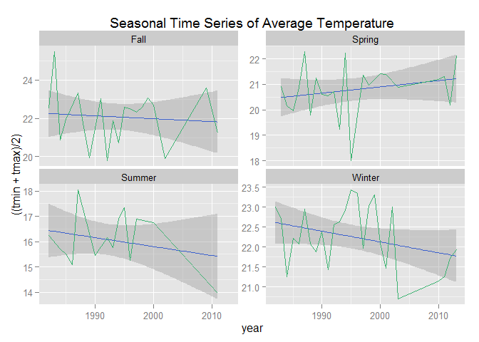 

```r
ggplot(seasonal,aes(y=(prcp),x=year))+
  facet_wrap(~season,scales = "free_y")+
  stat_smooth(method="lm", se=T, col="royalblue3", size=.5)+
  ggtitle("Seasonal Time Series of Precipitation")+
  geom_line(col="mediumseagreen", size=.5)
```

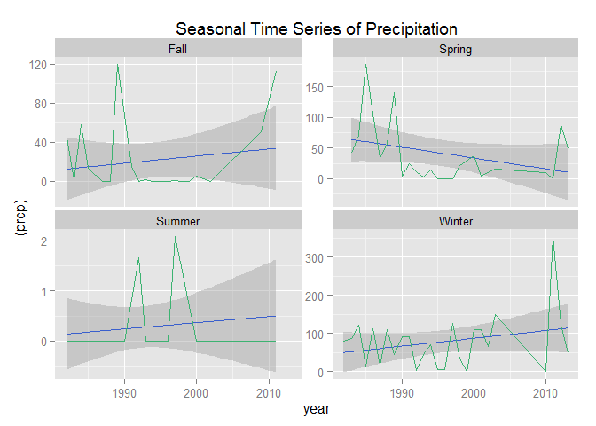 


####**Land Cover & Vegetation Indices (NDVI)**
Using MODIS data, Malawi is located at the horizontal 21 and vertical 10 position of the MODIS grid system. The products MCD12Q1(Land Cover Type Yearly L3 Global 500m SIN Grid) and MOD13Q1(Vegetation Indices 16-Day L3 Global 250m)

As taken from the NASA Earth Data, the Land Cover Type product will provide data characterizing five global land classification systems. The Vegetation Indices are designed to provide consistent spatial and temporal comparisons of vegetation conditions using the MODIS Normalized Difference Vegetation Index (NDVI) 


```r
datadir="data"
```

```r
#Testing for HDFfunctionality
gdalinfo(formats = T) %>% grep(pattern="HDF",value=T)
hdf=file.path(datadir,"MCD12Q1.A2004001.h21v10.051.2014287180042.hdf")

#Finding subdatasets: 
gdalinfo(hdf,nomd=T)
```


```r
#Plotting raster of MCD12Q1 for Malawi tiles
gdalwarp("HDF4_EOS:EOS_GRID:\"data/MCD12Q1.A2004001.h21v10.051.2014287180042.hdf\":MCD12Q1:Land_Cover_Type_1",
               "test.tif",t_srs='+proj=longlat +datum=WGS84',
		                      overwrite=TRUE,method='near')
```

```r
d=raster("test.tif")
d2=projectRaster(d,crs="+proj=longlat +datum=WGS84",method = "ngb")
d3=extend(d2,mw2)               
plot(d3)
plot(mw2, add=T)
```

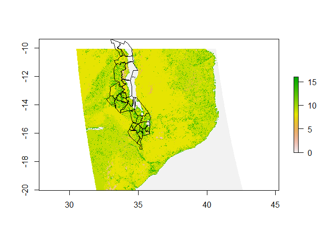 
**MODIS Land Cover Classes**

```r
  Land_Cover_Type_1 = c(
    Water = 0, 
    `Evergreen Needleleaf forest` = 1, 
    `Evergreen Broadleaf forest` = 2,
    `Deciduous Needleleaf forest` = 3, 
    `Deciduous Broadleaf forest` = 4,
    `Mixed forest` = 5, 
    `Closed shrublands` = 6,
    `Open shrublands` = 7,
    `Woody savannas` = 8, 
    Savannas = 9,
    Grasslands = 10,
    `Permanent wetlands` = 11, 
    Croplands = 12,
    `Urban & built-up` = 13,
    `Cropland/Natural vegetation mosaic` = 14, 
    `Snow & ice` = 15,
    `Barren/Sparsely vegetated` = 16, 
    Unclassified = 254,
    NoDataFill = 255)
```


```r
tab=table(values(d3))
tab.df=data.frame(table(values(d3)))
ggplot(tab.df,aes(x=Var1, y=Freq))+
      ggtitle("Summary of Land Cover Classes")+
      geom_bar(stat="identity", fill="seagreen4")
```

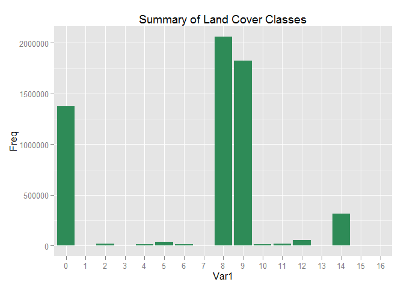 

The Land Cover is broken down into different classes. At first glance, by viewing the plot, it shows that the majority of the land is covered with classes 8-16. When viewing a table of the summary of the results, we can see that classes 8 and 9 account for the largest land cover. These are the Woody Savannas and Savannas of Malawi, respectively. According to MODIS, the Woody Savannas are "lands with herbaceous and other understory systems, and with forest canopy cover between 30-60%. The forest cover height exceeds 2 meters". The Savannas(9) are "lands with herbaceous and other understory systems, and with forest canopy cover between 10-30%. The forest cover height exceeds 2 meters". 

Another notable value is the Water(0). As viewed in the plot, a large majority of Malawi's land is dedicated to the lake that resides on its country boundaries. 

The rest of the land cover is primarily else made up of the other land classes, with a higher amount on class 14, which is the Cropland/Natural Vegetation Mosaics. According to MODIS, these "are lands with a mosaic of croplands,forests,shrub lands, and grasslands in which no one component comprises more than 60% of the landscape".


***
**MOD13Q1**

The Product MOD13Q1 are vegetation indices provided spatial and temporal comparisons of vegetation differences. 
This analysis views the Normalized Difference Vegetation Index (NDVI). Will be using Band [10]: "250m_16_days_NDVI" 

The data are provided every 16 days at 250-meter spatial resolution and are computed from atmospherically corrected bi-directional surface reflectances that have been masked for water, clouds, heavy aerosols, and cloud shadows. 


```r
maldir=file.path(datadir,"mal")
if(!file.exists(maldir)) dir.create(maldir)
```

```r
#Binding the data frame by latitude and longitude coordinates
loc=rbind.data.frame(
  list("Malawi",-13.9500, 33.7000))
colnames(loc)=c("loc","lat","long")
coordinates(loc)=cbind(loc$long,loc$lat)

#Changing date format
mdates=GetDates(Product = "MCD12Q1", Lat = loc$lat[1], Long = loc$long[1])
dates=mdates%>%sub(pattern="A",replacement="")%>%as.Date("%Y%j")

loc$start.date <- min(as.numeric(format(dates,"%Y")))
loc$end.date <- max(as.numeric(format(dates,"%Y")))
```


```r
MODISSubsets(LoadDat = loc,
              Products = c("MOD13Q1"),
              Bands = c( "250m_16_days_NDVI", "250m_16_days_pixel_reliability"),
              Size = c(10,10),
              SaveDir=maldir,
              StartDate=T)               
```

```
## Files downloaded will be written to data/mal.
## Found 1 unique time-series to download.
## Getting subset for location 1 of 1...
## Full subset download complete. Writing the subset download file...
## Done! Check the subset download file for correct subset information and download messages.
```

```r
MODISGrid(Dir = maldir,
           DirName = "modgrid",
           SubDir = TRUE,
           NoDataValues=
               list("MOD13Q1" = c( "250m_16_days_NDVI" = -3000,
                                   "250m_16_days_pixel_reliability" = -1)))
```

```
## Files downloaded will be written to data/mal/modgrid.
## Creating new GIS ASCII files from MODIS data file 1 out of 1
```

```r
mal_files=list.files(file.path(maldir,"modgrid"),recursive=T,
                     pattern="250m_16_days_NDVI.*asc",full=T) 
```

```r
mal=stack(mal_files)
plot(mal[[1:2]])
```

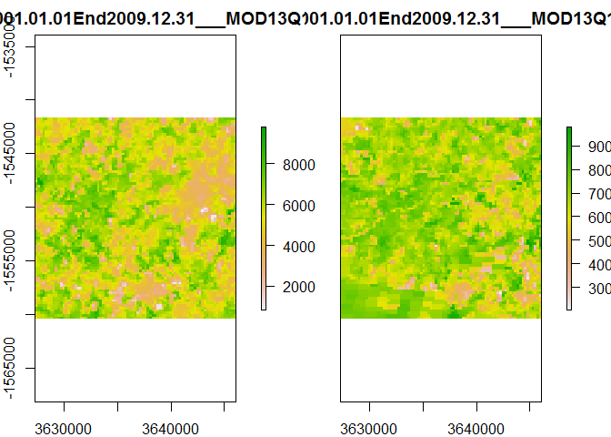 


```r
#Retrieving bands for MCD12Q1 and MOD13Q1
GetBands(Product = "MCD12Q1")
GetBands(Product = "MOD13Q1")
```

####**Results**

This analysis begins by mapping the elevation of Malawi in metres. The map shows that the elevation is relatively uniform throughout the country, which means it most likely does not have a large impact on the crops being yielded. The plot also shows that the lower elevations are on the right edges of the country boundaries, which is where it borders Lake Malawi. 

Next, the analysis examines the top three crops produced in the country. After plotting the area harvested, crop yields and production, some important results can be seen. As stated above, according to the Area Harvested plot, Maize takes up the most amount of hectares of Malawi's land. This would make one assume that Maize is one of Malawi's top exports and so is grown most readily. Another assumption would be that it is the crop easiest to yield and is not as susceptible to climate and vegetation covers. 

However, after viewing the Crop Yields, it is interesting to note that Maize is one of the least yielded crops of the three. The plot shows for Cassava and Potatoes that the yield began to increase around the year 2000. However, around 2005, it dipped again, but has been rising ever since. This is a similar trend to what is shown in the Production of the crops, where there is an increase in production for all three crops around the year 2000, which dip again around 2005, and then have been on an increase since.

The next step the analysis takes is to examine whether or not climate had an impact on the yields. Particularly of interest, after viewing the area harvested and yields, is the production of Maize. The plotting of the seasonal time series averages for temperature and precipitation prove to provide some reasoning behind the yields. The examination of the average temperature tends to be sporadic by season. Roughly, the temperature centers around the 20-23 degrees Celsius range from the Spring, Fall, and Winter. However, Summer average temperatures are much lower around the 15-17 degrees Celsius range. It is also shown The Fall and Winter time have an extreme low drop in temperature right after the year 2000. This is also when the crop yields dropped for Cassava and Potatoes.

The time series of precipitation data is shown to be extremely volatile for the Winter months. Malawi during the Summer is shown to have the least amount of precipitation. These dry months can have a harmful effect on crop yields. However, it is also interesting to note that the Fall and Spring used to have higher levels of precipitation until the mid 1990s. It was after this that the precipitation levels dropped significantly; proving there was most likely an extreme drought in Malawi. After the mid 2000s, the precipitation levels have seemed to pick up again; directly in correlation with the crop yields. 

Not only does climate have an effect on the yields, but as shown in the MODIS data, the vegetation indices of the land also can prove to have negative or positive effects for growing. The NDVI data shows a large majority of Malawi is comprised of water, leaving it with even less terrain that is possible for growing. The plot details that the majority of land cover for the rest of the country is comprised of a large amount of Woody Savannas and Savannas, both of which comprise of forest canopy cover. There is also a higher level of land cover that is made up of croplands, forests, shrublands, and grasslands. Although, this value is defined that no one component comprises more than 60% of the landscape.

####**Discussion/Conclusion**

Malawi has shown a very interesting development for their agricultural structure. The expected results before producing this analysis was that the main reason for changes in crop yield and production are due to climate. However, after examining the NDVI and land cover, it is easy to see that a majority of Malawi's terrain is unsuitable for growing. Although climate proves to be the main reasoning behind crop fluctuations, further research detailed in the introduction of this analysis has shown government intervention into the agricultural sector of Malawi. Therefore, one cannot assume that climate and land cover alone are responsible for crop yields, and especially for why there is a change right around the 2005 period. Other reasons can include market fluctuation, government intervention through subsidizing, as well as, other severe weather occurrences not detailed in this analysis. A few other factors to note that could have an effect on growing are increased population as stated in the introduction. With an increase in population, natural resources are depleted more readily. This may also leave farmers without the resources they need for production.

Overall, Malawi remains largely agriculturally based, despite being one of the smallest countries in Africa. According to the UNDP, more than one-third of their GDP and 90% of export revenues come from their agricultural sector. This is why it is extremely important for the people of Malawi to take into account different factors that affect their production and why it is so important to the government to intervene. In the end, they still remain the "Heart of Africa"

#####**_Author Skepticism_**

Through putting together this analysis, there still remains some skepticism as to whether or not it is an accurate representation of the effects of climate and land cover on crop yields. First off, there is uncertainty if all the dates line up. For example, the dates and time series for the climate data may differ from that of the crop data pulled. There are also more data that should be implemented to provide a more accurate depiction of the country as a whole. For example, the climate data above gives an average temperature and precipitation. However, when examining the effects of climate on crop yield, it would also be important to look at frost days, long drought periods and the growing season length. Another possible implication of the way the climate data was obtained is that it was done by station. Therefore, it provides a representation of the climate at a certain latitude and longitude (The International Airport) in Malawi. However, the climate of a country could be very different up north versus south, and, therefore, remains an uncertainty to the analysis.

In obtaining the crop data from FAOSTAT3, it is easy to see that while some data has been officially collected, other data is an FAO estimate. This could cause skewed results. Another skepticism this analysis gives is through the MODIS Land Cover data. To further this analysis, more could be done to depict an accurate representation of a time series of the NDVI Vegetation and to summarize temperatures by land cover. Also, overlaying more of the plots on a map of Malawi would enable users and readers to examine the data more clearly. These functions would extremely enhance this analysis and provide a more accurate and detailed depiction. However, through other trial and error, these functions have not been able to been implemented at this time. 

***

####**References**

**_Climate Data -- NCDC.NOAA_**

Peterson, T.C., and R.S. Vose, 1997: An overview of the Global Historical Climatology Network temperature database. Bulletin of the American Meteorological Society, 78 (12), 2837-2849

**_FAO:_**

Food and Agriculture Organization of the United Nations. (2012). FAOSTAT Database. Rome, Italy: FAO. Retrieved November 13, 2015 from http://faostat3.fao.org/home/E

_FAO Sites accessed individually:_

http://www.fao.org/
http://www.fao.org/nr/gaez/about-data-portal/agricultural-suitability-and-potential-yields/en/  
http://faostat.fao.org/site/375/default.aspx
http://faostat.fao.org/site/567/DesktopDefault.aspx?PageID=567#ancor

**_MODIS_**

ORNL DAAC. 2008. MODIS Collection 5 Land Products Global Subsetting and Visualization Tool. ORNL DAAC, Oak Ridge, Tennessee, USA. Accessed December 10, 2015. Subset obtained for MOD13Q1 product at 13.95S,33.7E, time period: 2000-02-18 to 2015-11-17, and subset size: 20.25 x 20.25 km. http://dx.doi.org/10.3334/ORNLDAAC/1241

**_Other_**

Global Administrative Areas ( 2012). GADM database of Global Administrative Areas, version 2.0. [online] URL: www.gadm.org.

"New Agriculturist." : Country Profile. Accessed December 13, 2015. http://www.new-ag.info/en/country/profile.php?a=2488.

"About Malawi." UNDP in Malawi. N.p., n.d. Web. 14 Dec. 2015. <http://www.mw.undp.org/content/malawi/en/home/countryinfo.html>.
